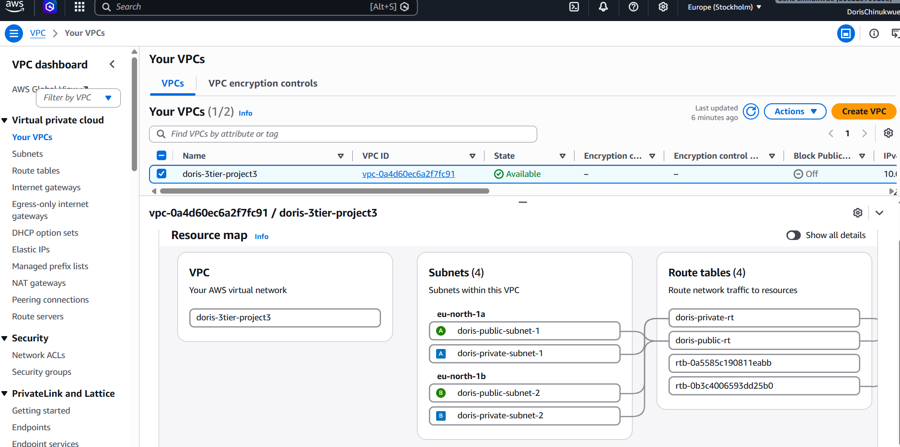
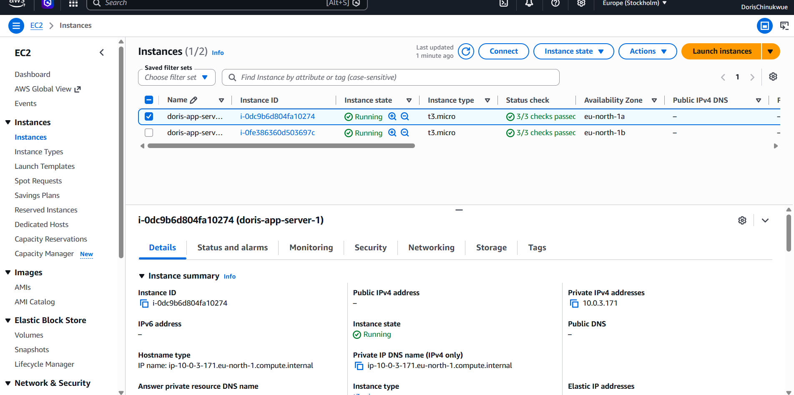
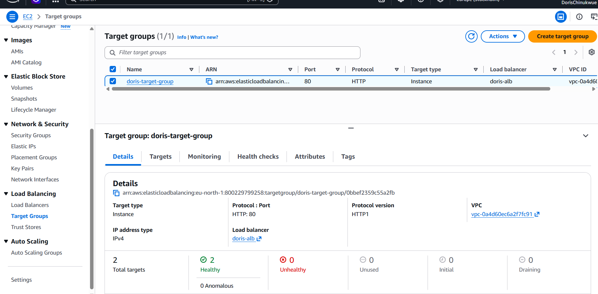
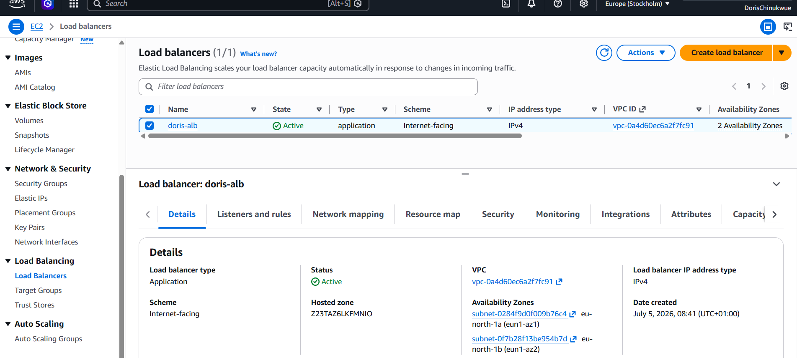
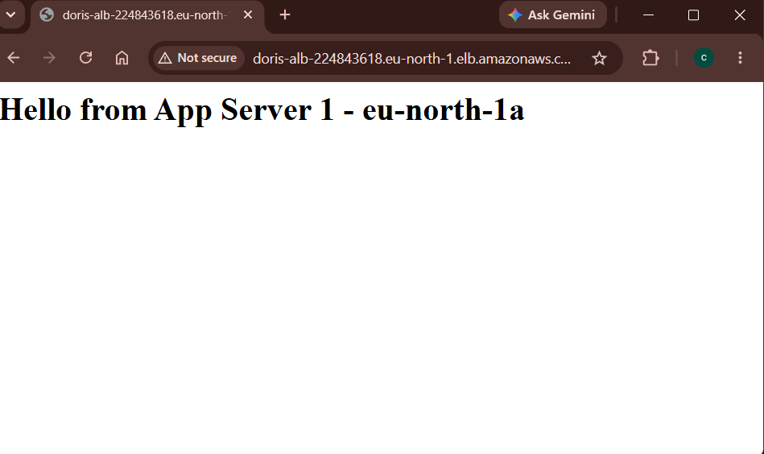
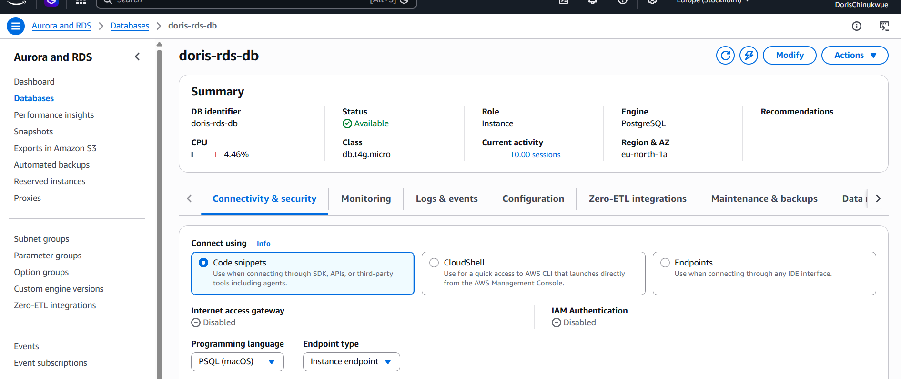
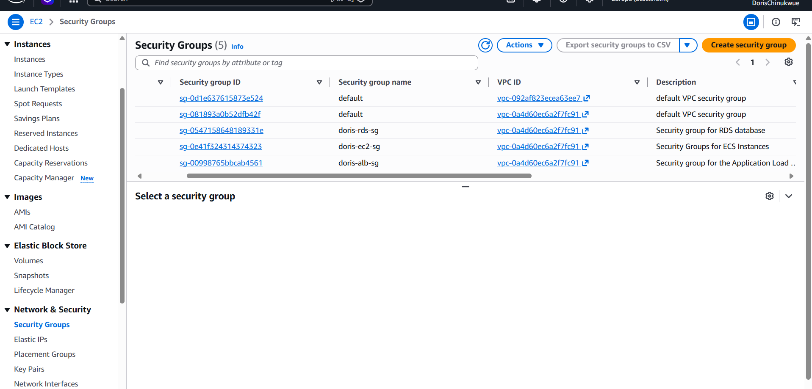

# AWS 3-Tier Architecture

A highly available, production-ready 3-tier web application architecture deployed on AWS across multiple Availability Zones.

---

## What This Project Is

This project demonstrates a production-grade 3-tier architecture on AWS which is the same pattern used by real companies to run secure, scalable web applications.

The three tiers are:

- **Tier 1 - Presentation:** Application Load Balancer sitting in public subnets, facing the internet. This is the only resource directly reachable from outside.
- **Tier 2 - Application:** Two EC2 instances running Apache web server, sitting in private subnets. They never talk to the internet directly only through the ALB in front and the database behind.
- **Tier 3 - Database:** RDS PostgreSQL in private subnets. Only the EC2 instances can reach it. The internet cannot touch it at all.

---

## Architecture Diagram

```
                        INTERNET
                            |
                            ↓
          ┌─────────────────────────────────────┐
          │     Application Load Balancer        │
          │   (public subnets - eu-north-1a/1b)  │
          └─────────────────────────────────────┘
                    |                   |
                    ↓                   ↓
          ┌─────────────────┐ ┌─────────────────┐
          │  EC2 App Server │ │  EC2 App Server │
          │       1         │ │       2         │
          │  eu-north-1a    │ │  eu-north-1b    │
          │ (private subnet)│ │ (private subnet)│
          └─────────────────┘ └─────────────────┘
                    |                   |
                    └─────────┬─────────┘
                              ↓
          ┌─────────────────────────────────────┐
          │         RDS PostgreSQL               │
          │  (private subnets - eu-north-1a)     │
          │   Managed database - no EC2 needed   │
          └─────────────────────────────────────┘
```

---

## Screenshots

### VPC and Subnets


### EC2 Instances Running


### Target Group - Both Instances Healthy


### Load Balancer Active


### Live Application in Browser


### RDS Database Available


### Security Groups


## AWS Services Used

| Service | Purpose |
|---------|---------|
| VPC | Isolated private network for the entire architecture |
| Internet Gateway | Allows internet traffic into the public subnets |
| NAT Gateway | Allows private instances to reach the internet for updates without being directly exposed |
| Public Subnets (x2) | Host the ALB across 2 Availability Zones |
| Private Subnets (x2) | Host the EC2 instances and RDS across 2 Availability Zones |
| Route Tables | Direct traffic to the right destination - public subnets to IGW, private subnets to NAT Gateway |
| Security Groups | Layered firewall rules that chain each tier together |
| EC2 t3.micro (x2) | Application servers running Apache web server, one per Availability Zone |
| Application Load Balancer | Receives internet traffic and distributes it across both EC2 instances |
| Target Group | Registers the EC2 instances and runs health checks on them |
| RDS PostgreSQL db.t4g.micro | Managed relational database - AWS handles patching, backups, and monitoring |

---

## Network Design

| Resource | CIDR Block | Availability Zone | Type |
|----------|------------|-------------------|------|
| VPC | 10.0.0.0/16 | - | - |
| Public Subnet 1 | 10.0.1.0/24 | eu-north-1a | Public |
| Public Subnet 2 | 10.0.2.0/24 | eu-north-1b | Public |
| Private Subnet 1 | 10.0.3.0/24 | eu-north-1a | Private |
| Private Subnet 2 | 10.0.4.0/24 | eu-north-1b | Private |

---

## Security Architecture

The security groups are chained together so each tier only accepts traffic from the tier directly above it. Nothing can bypass this chain.

| Security Group | Inbound Rule | Source | Purpose |
|---------------|-------------|--------|---------|
| doris-alb-sg | HTTP port 80, HTTPS port 443 | 0.0.0.0/0 (internet) | ALB accepts all internet traffic |
| doris-ec2-sg | HTTP port 80 | doris-alb-sg only | EC2 only accepts traffic from the ALB |
| doris-rds-sg | PostgreSQL port 5432 | doris-ec2-sg only | RDS only accepts traffic from EC2 |

**Key security decisions:**
- RDS public access is set to **No** — the database has no public IP address and cannot be reached from the internet under any circumstances
- EC2 instances have no public IP — they are only reachable through the ALB
- NAT Gateway allows private instances to pull updates from the internet without exposing them to inbound connections

---

## What I Learned Building This

- **Internet Gateway vs NAT Gateway** — the IGW lets traffic flow both ways for public resources. The NAT Gateway lets private resources reach out to the internet without letting anything come back in directly. Two completely different jobs.

- **Why RDS does not need an EC2 instance** — RDS is a fully managed service. AWS provisions and manages the underlying server, operating system, patches, and backups automatically. You just connect to the endpoint it gives you.

- **How ALB health checks work** — the ALB sends an HTTP request to `/` on each instance every 30 seconds. If the instance responds with 200 OK, it is marked healthy and receives traffic. If it does not respond, the ALB stops sending traffic to it and waits for it to recover.

- **Security group chaining** — instead of opening ports to the whole internet on EC2 and RDS, you set the source to the security group of the tier above it. Only traffic that came through that specific resource is allowed through.

- **What High Availability means in practice** — spreading resources across 2 Availability Zones means a single data centre failure does not take down the application. The ALB automatically routes all traffic to the healthy AZ.

---

## What Broke and How I Fixed It

- **ALB showed a reachability warning after creation** — turned out the inbound rules on doris-alb-sg needed to explicitly allow HTTP traffic from 0.0.0.0/0 on port 80. Once confirmed, the ALB became reachable.

- **RDS rejected the username "admin"** — admin is a reserved keyword in PostgreSQL and cannot be used as a master username. Fixed by changing it to `dorisadmin`.

- **Could not create project folder in C:\Users** — C:\Users is a protected Windows system directory. Fixed by navigating to C:\Users\USER which is the personal home folder with full write permissions.

- **Browser only showed Server 1** — the browser was caching the connection to the same server. Both targets were confirmed healthy in the target group. In production with real traffic from multiple users, the ALB distributes requests across both servers automatically.

---

## Monthly Cost Estimate

| Service | Free Tier | After Free Tier |
|---------|-----------|-----------------|
| EC2 2x t3.micro | $0 | ~$15/month |
| RDS db.t4g.micro | $0 | ~$12/month |
| Application Load Balancer | - | ~$16/month |
| NAT Gateway | - | ~$32/month |
| **Total** | **~$0** | **~$75/month** |

> **Cost note:** The NAT Gateway is the most expensive component at this scale (~$32/month). In a cost-optimised production setup you could replace it with VPC Gateway Endpoints for S3 and DynamoDB access, and a NAT instance (t3.nano) for everything else at roughly $3/month.

---

## How to Reproduce This Architecture

1. Create a VPC (`10.0.0.0/16`) with 2 public and 2 private subnets across 2 Availability Zones
2. Attach an Internet Gateway to the VPC
3. Create a NAT Gateway in one of the public subnets and allocate an Elastic IP to it
4. Create a public route table with a route `0.0.0.0/0 → Internet Gateway` and associate both public subnets
5. Create a private route table with a route `0.0.0.0/0 → NAT Gateway` and associate both private subnets
6. Create 3 security groups: ALB (open to internet), EC2 (open to ALB SG only), RDS (open to EC2 SG only)
7. Create an RDS DB subnet group using both private subnets
8. Launch an RDS PostgreSQL instance in the private subnets using the subnet group — set public access to No
9. Launch 2 EC2 instances in the private subnets with the following user data script to install Apache:

```bash
#!/bin/bash
yum update -y
yum install -y httpd
systemctl start httpd
systemctl enable httpd
echo "<h1>Hello from App Server - [AZ name]</h1>" > /var/www/html/index.html
```

10. Create a target group, register both EC2 instances, and enable HTTP health checks on `/`
11. Create an Application Load Balancer in the public subnets, attach the `doris-alb-sg` security group, and set the listener to forward to the target group
12. Wait for both targets to show **Healthy** in the target group
13. Open the ALB DNS name in a browser — you should see the Apache response

---

## Key Concepts This Project Covers for the AWS SAA-C03 Exam

- VPC design with public and private subnet separation
- Internet Gateway vs NAT Gateway
- Application Load Balancer and target group health checks
- Security group chaining and least privilege networking
- RDS as a managed service vs self-hosted databases
- High availability across multiple Availability Zones
- Route table associations and traffic routing
